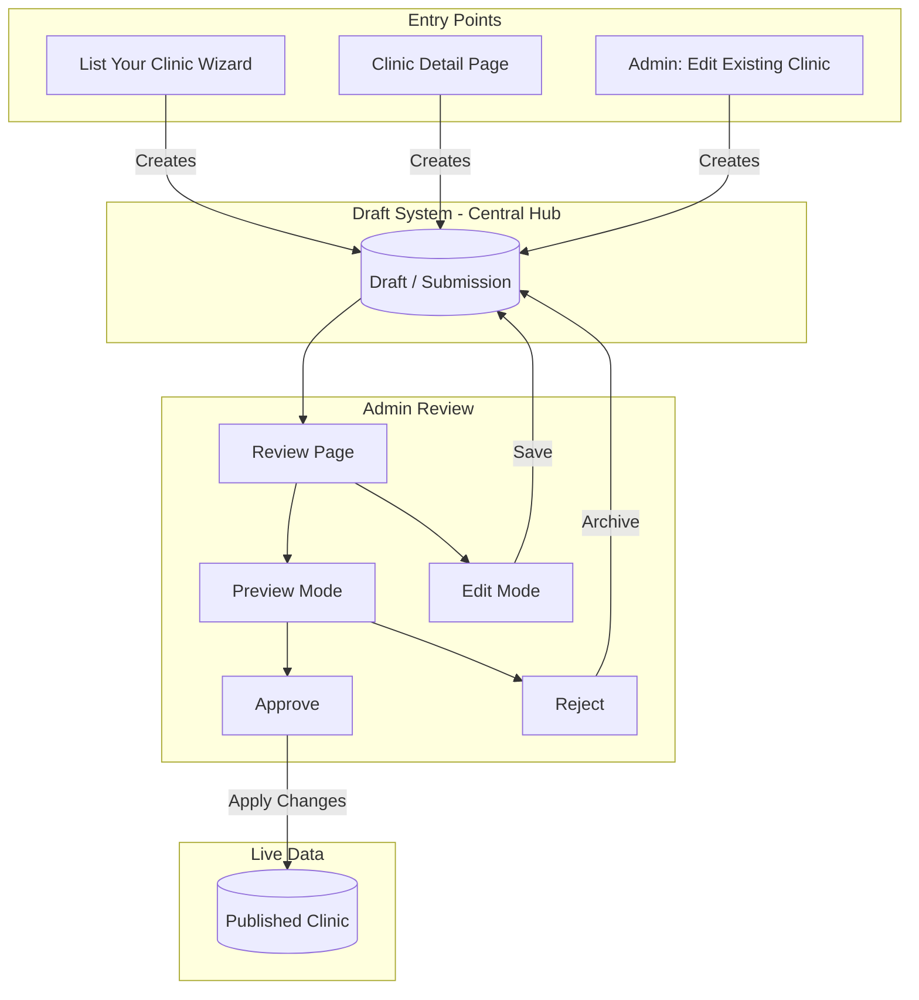
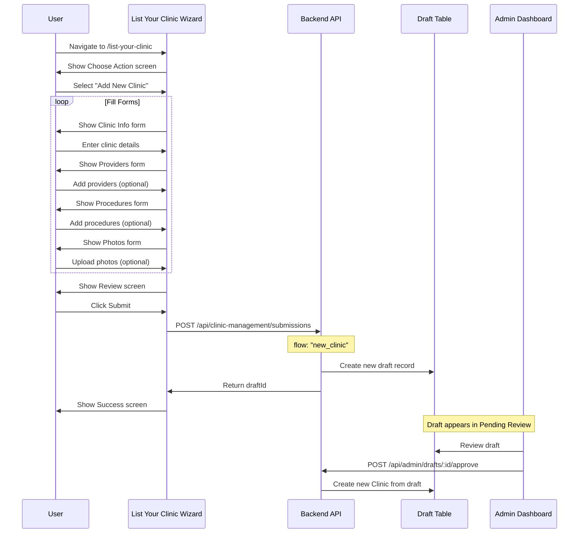
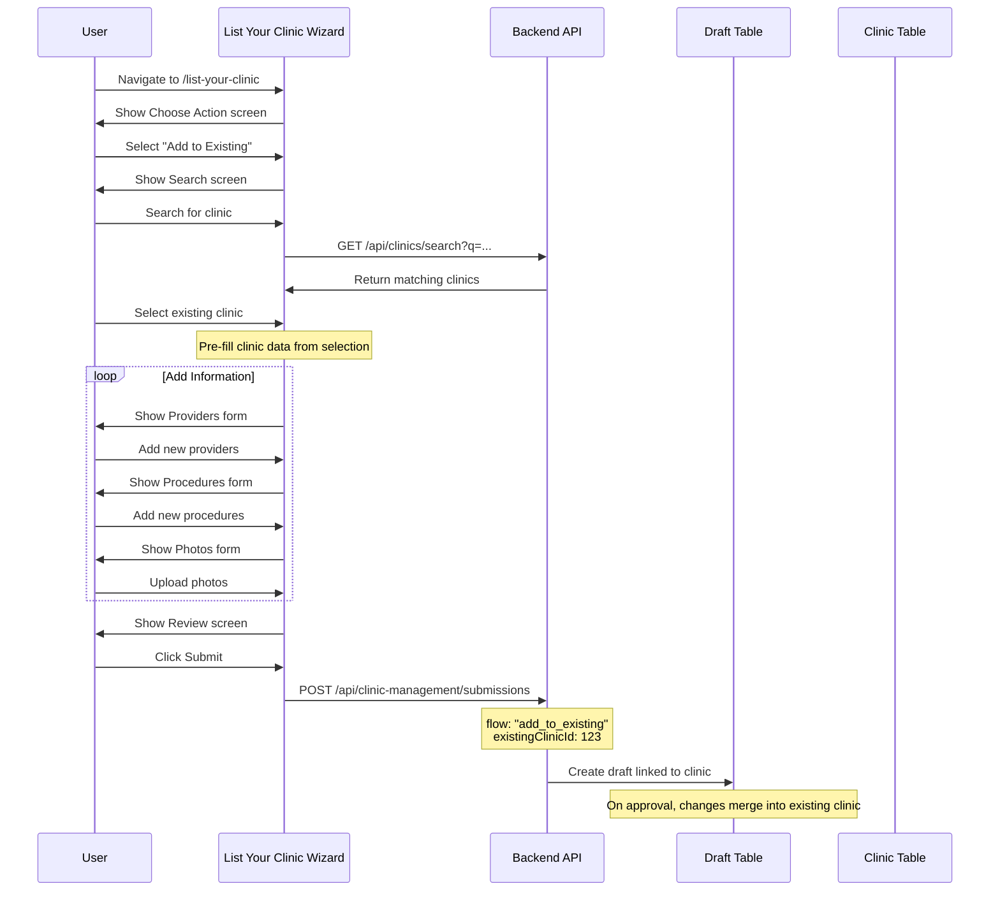
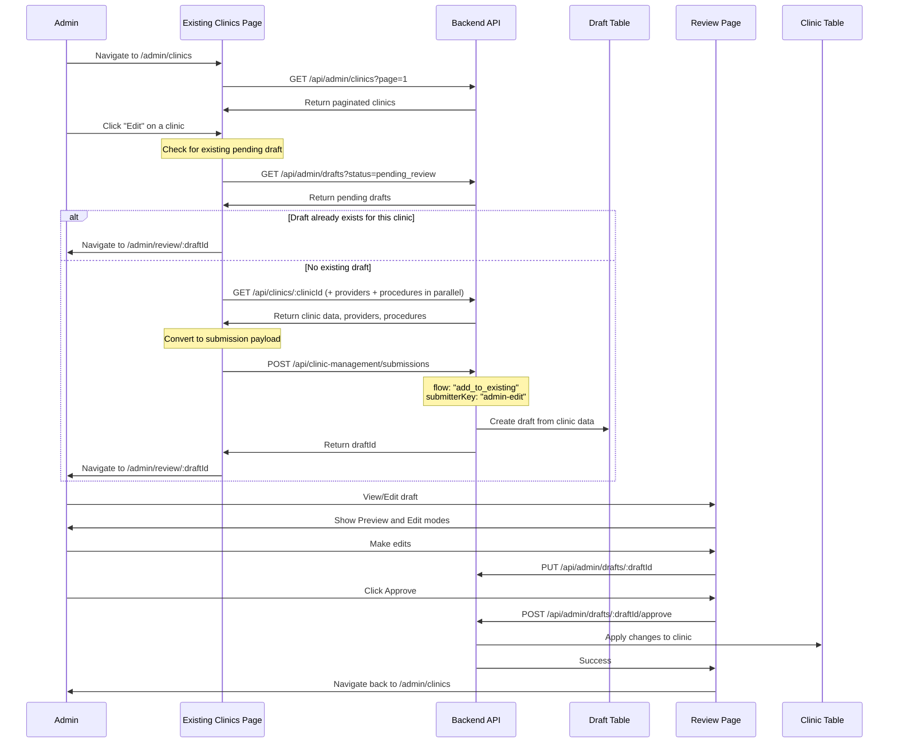
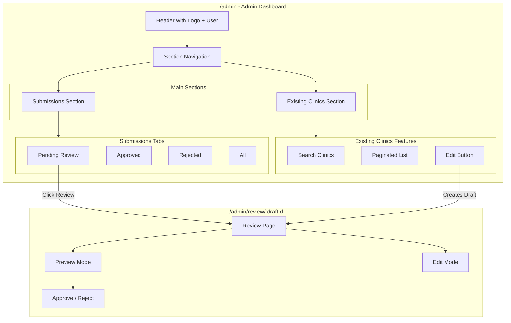
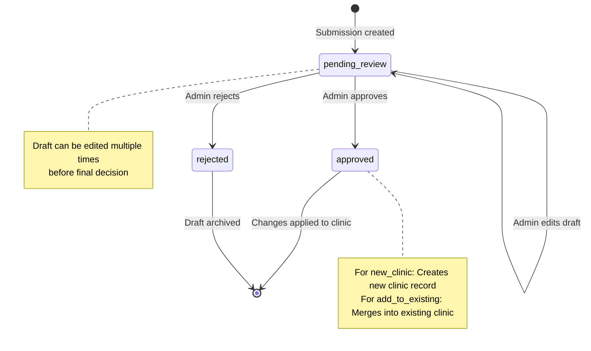
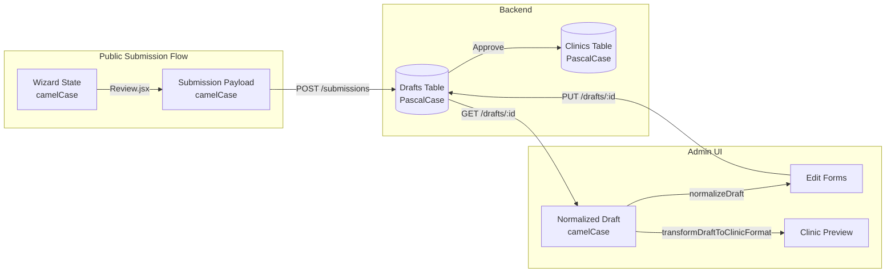

# Clinic Management Flows

This document provides comprehensive Mermaid diagrams showing how clinic data flows through the Glowra system, including the draft/submission system, admin review process, and all entry points.

---

## System Overview

The clinic management system uses a **draft-based workflow** where all changes (new clinics or edits to existing ones) go through a review process before being published.

---

## Detailed Flow: Public User Submits New Clinic

---

## Detailed Flow: Public User Adds to Existing Clinic

---

## Detailed Flow: Admin Edits Existing Clinic (NEW)

---

## Admin Dashboard Navigation Structure

---

## Draft States Lifecycle

---

## Data Transformation Flow

---

## Key Files Reference

| Component | File Path | Purpose |
|-----------|-----------|---------|
| Public Wizard | `src/pages/list-your-clinic/ListYourClinic.jsx` | Multi-step form for public submissions |
| Wizard State | `src/pages/list-your-clinic/hooks/useWizardState.js` | State management with localStorage |
| Admin Layout | `src/pages/admin/AdminLayout.jsx` | Protected layout with section nav |
| Submissions Dashboard | `src/pages/admin/AdminDashboard.jsx` | List pending/approved/rejected drafts |
| Existing Clinics | `src/pages/admin/ExistingClinicsPage.jsx` | Browse and edit existing clinics |
| Review Page | `src/pages/admin/ReviewPage.jsx` | Preview/edit individual drafts |
| Edit Tabs | `src/pages/admin/components/EditTabs.jsx` | Tabbed editor for draft data |
| Draft Preview | `src/pages/admin/components/DraftClinicPreview.jsx` | Preview clinic using real components |
| Draft Normalizer | `src/pages/admin/utils/draftToClinicFormat.js` | Transform draft data for UI |
| Clinic to Draft | `src/pages/admin/utils/clinicToDraftFormat.js` | Convert clinic to submission payload |

---

## API Endpoints Summary

### Public Endpoints (No Auth)
| Method | Endpoint | Purpose |
|--------|----------|---------|
| POST | `/api/clinic-management/submissions` | Create new submission/draft |
| GET | `/api/clinics/search?q=...` | Search existing clinics |
| GET | `/api/clinics/:id` | Get clinic details |
| GET | `/api/clinics/:id/providers` | Get clinic providers |
| GET | `/api/clinics/:id/procedures` | Get clinic procedures |

### Admin Endpoints (JWT Auth Required)
| Method | Endpoint | Purpose |
|--------|----------|---------|
| GET | `/api/admin/clinics?page=&search=` | List all clinics (paginated) |
| GET | `/api/admin/drafts?status=` | List drafts by status |
| GET | `/api/admin/drafts/:id` | Get single draft details |
| PUT | `/api/admin/drafts/:id` | Update draft data |
| POST | `/api/admin/drafts/:id/approve` | Approve and publish |
| POST | `/api/admin/drafts/:id/reject` | Reject submission |
| GET | `/api/admin/stats` | Get submission counts |

